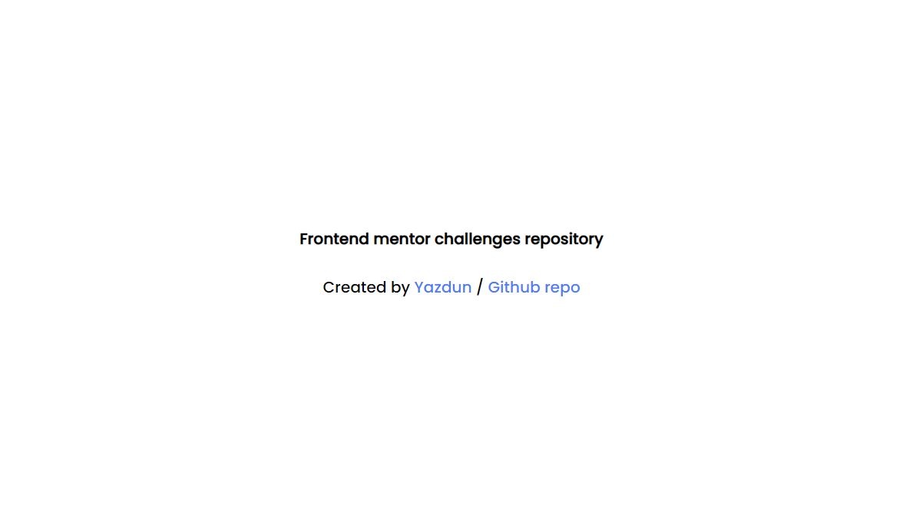

<!-- PROJECT LOGO -->
 

  

<h1 align="center">Frontend mentor solutions</h1>

  

    Hello everyone ! I upload my frontend mentor solutions on this repository, feel free to explore branches and tell me if there are better practices for my solutions
     
    <a href="https://github.com/Yazdun/frontend_mentor"><strong>Explore the docs »</strong></a>
     
     
    <a href="https://yazdun.github.io/frontend_mentor/">View Demo</a>
    ·
    <a href="https://github.com/Yazdun/frontend_mentor/issues">Report Bug</a>
    ·
    <a href="https://github.com/Yazdun/frontend_mentor/issues">Request Feature</a>
  

<!-- TABLE OF CONTENTS -->

  
Table of Contents

  <ol>
    <li>
      <a href="#about-the-project">About The Project</a>
      <ul>
        <li><a href="#built-with">Built With</a></li>
      </ul>
    </li>
    <li>
      <a href="#getting-started">Getting Started</a>
    </li>
    <li><a href="#contributing">Contributing</a></li>
    <li><a href="#contact">Contact</a></li>
  </ol>

<!-- ABOUT THE PROJECT -->
## About The Project

I use this repo as a starter template for my challenges and each challenge is on a separate branch. I mainly use `html` `sass` `javascript` for the challenges on this repo

(<a href="#top">back to top</a>)

### Built With

* [Html](https://developer.mozilla.org/en-US/docs/Web/HTML)
* [Sass](https://sass-lang.com/documentation)
* [Javascript](https://developer.mozilla.org/en-US/docs/Web/JavaScript)

(<a href="#top">back to top</a>)

<!-- GETTING STARTED -->
## Getting Started

You should be comfortable with sass in order to use this repo, you won't need any installation to run the applications, you can clone or fork the repo on your local machine and start using it !

## Contributing

If you find any better solution I really encourage you to inform and help me to become a better developer ! contributions are **greatly appreciated**.

1. Fork the Project
2. Create your Feature Branch (`git checkout -b feature/AmazingFeature`)
3. Commit your Changes (`git commit -m 'Add some AmazingFeature'`)
4. Push to the Branch (`git push origin feature/AmazingFeature`)
5. Open a Pull Request

(<a href="#top">back to top</a>)

<!-- CONTACT -->
## Contact

Twitter - [@Yazdun](https://twitter.com/Yazdun) 
Telegram - [@Yazdun](https://t.me/Yazdun) 

(<a href="#top">back to top</a>)

