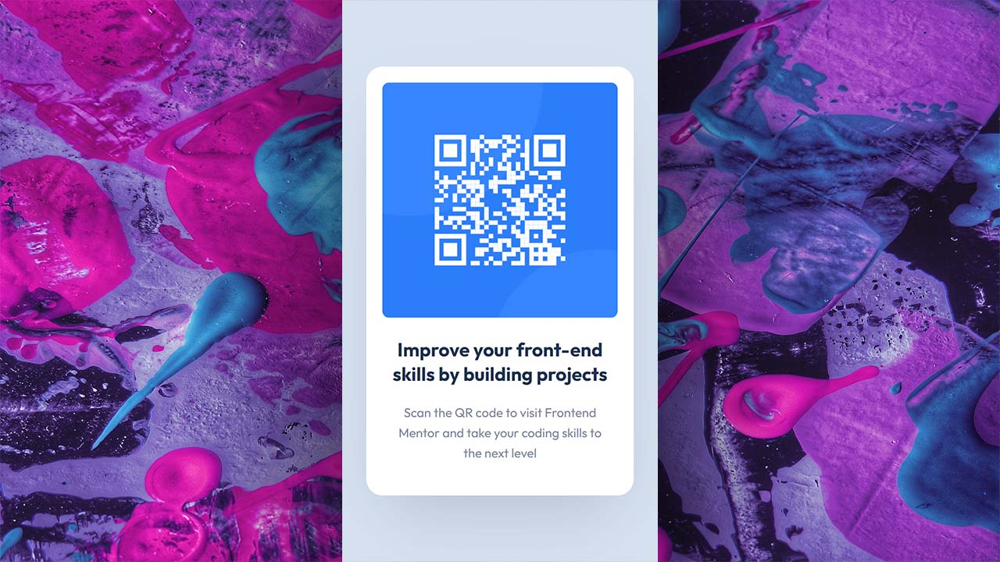

<!-- PROJECT LOGO -->
 

  

<h3 align="center">qr code component</h3>

  

    Newbie frontend mentor challenge
     
    <a href="https://www.frontendmentor.io/solutions/simple-but-yet-very-cool-challenge-HOlB49vmd"><strong>View on frontend mentor »</strong></a>
     
     
    <a href="https://yazdun-qr-code.netlify.app/">View Demo</a>
    ·
    <a href="https://github.com/Yazdun/frontend_mentor/issues">Report Bug</a>
    ·
    <a href="https://github.com/Yazdun/frontend_mentor/issues">Request Feature</a>
  

## Contributing

Thank you for browsing this repo. Any contributions you make are **greatly appreciated**.

If you have a suggestion that would make this better, please fork the repo and create a pull request. You can also simply open an issue with the tag "enhancement".
Don't forget to give the project a star! Thanks again!

1. Fork the Project
2. Create your Feature Branch (`git checkout -b feature/AmazingFeature`)
3. Commit your Changes (`git commit -m 'Add some AmazingFeature'`)
4. Push to the Branch (`git push origin feature/AmazingFeature`)
5. Open a Pull Request
