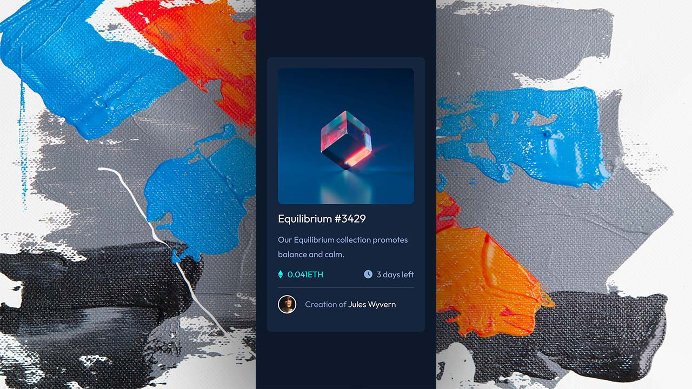

<!-- PROJECT LOGO -->
 

  

<h3 align="center">Faq accordion card</h3>

  

    Newbie frontend mentor challenge
     
    <a href="https://github.com/Yazdun/frontend_mentor"><strong>Explore main repo »</strong></a>
     
     
    <a href="yazdun-faq-accordion-card.netlify.app">View Demo</a>
    ·
    <a href="https://github.com/Yazdun/frontend_mentor/issues">Report Bug</a>
    ·
    <a href="https://github.com/Yazdun/frontend_mentor/issues">Request Feature</a>
  

## My approach for solving this challenge

Instead of hardcoding questions and answers into the `html`, I created a `data.js` file which contains all the questions and answers plus unique `id` for each one, then I `looped` through the data using `map` function and rendered `html` for each question, I think this way is much easier to handle and maintain, plus it makes it easier to add new questions to our accordion

### Built With

* [Html](https://developer.mozilla.org/en-US/docs/Web/HTML)
* [Sass](https://sass-lang.com/documentation)
* [Javascript](https://developer.mozilla.org/en-US/docs/Web/JavaScript)
  

## HUGE THANKS !
For this challenge, First I studied [Vanzasetia](https://github.com/vanzasetia/faq-accordion-card)'s repo on this solution which was pretty helpful, Then I implemented what I learned to my project.

<!-- GETTING STARTED -->
## Getting Started

You should be comfortable with sass and javascript in order to use this repo, you won't need any installation to run the applications, you can clone or fork the repo on your local machine and start using it !

<!-- CONTRIBUTING -->
## Contributing

Thank you for browsing this repo. Any contributions you make are **greatly appreciated**.

If you have a suggestion that would make this better, please fork the repo and create a pull request. You can also simply open an issue with the tag "enhancement".
Don't forget to give the project a star! Thanks again!

1. Fork the Project
2. Create your Feature Branch (`git checkout -b feature/AmazingFeature`)
3. Commit your Changes (`git commit -m 'Add some AmazingFeature'`)
4. Push to the Branch (`git push origin feature/AmazingFeature`)
5. Open a Pull Request

<!-- CONTACT -->
## Contact

>Frontend mentor - [@Yazdun](https://www.frontendmentor.io/profile/Yazdun)

>Twitter - [@Yazdun](https://twitter.com/Yazdun) 

>Telegram - [@Yazdun](https://t.me/Yazdun) 
